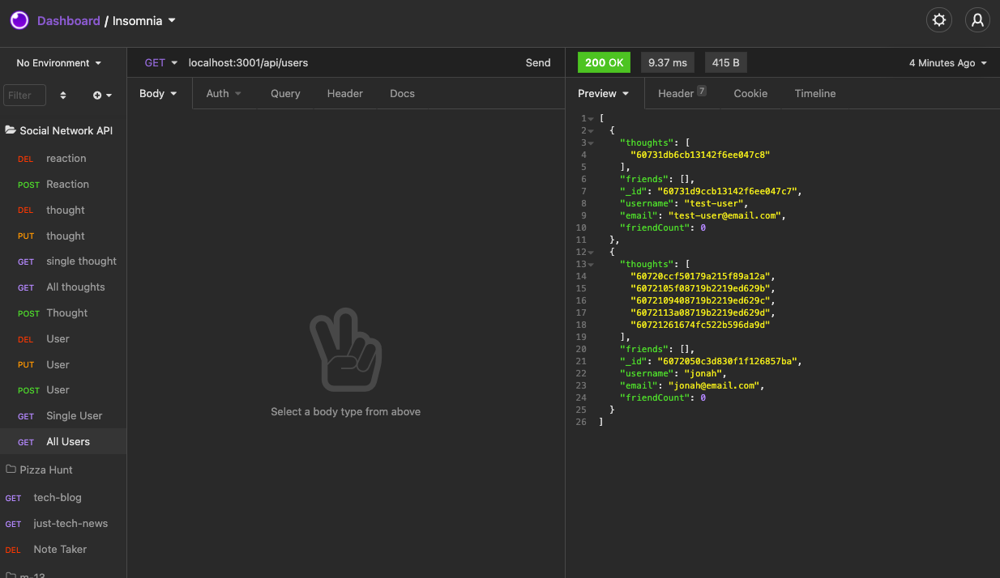
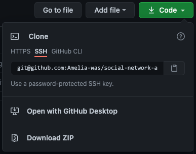

# Social Network API &nbsp;&nbsp;&nbsp;

## Description

Social Media API using NoSQL. This express.js API forms the backend for a social media website. Users can be created, edited, and deleted from the database using a third-party API client such as Insomnia Core. 

# Table of Contents
1. [Requirements](#requirements)
2. [Installation](#installation)
3. [Usage](#usage)
4. [Questions](#questions)
5. [License](#license)

## Requirements
To use this app, you must have the following installed:
- [Node.js](https://nodejs.org/en/)
- [MongoDB](https://dev.mysql.com/downloads/mysql/)
- [Insomnia Core](https://insomnia.rest/products/insomnia) or a similar API client.

A basic knowledge of the command line is also required. See [here](https://datacarpentry.org/shell-genomics/02-the-filesystem/index.html) for help navigating directories in the command line.

## Installation

1. To install the app, clone the respository above, or download as a .zip file.

2. In the command line, navigate to the directory containing the downloaded repsitory.
3. Download the required dependencies by typing the following in the command line: `npm install`

## Usage
To create the database:
1. Step 

To make requests to the database:
1. In the root directory of the app, start the server by entering `npm start` in the command line.
2. Enter the URL `http://localhost:3001/api` in Insomnia Core.
3. In Insomnia Core, you can make GET, POST, PUT, and DELETE requests for users, thoughts, and reactions.

A video walkthrough of the API requests being tested in Insomnia Core can be found [here](https://drive.google.com/file/d/1f4tVzQpUijBDjdZnTxcCW1WMFDQNAxcE/view?usp=sharing).

## Questions
For additional questions, contact Amelia:

GitHub: [amelia-was](https://github.com/amelia-was)

## Built Using
- JavaScript
- Node.js
- Express.js
- MongoDB with Mongoose ODM

## License
Under the MIT license, this material is free to modify and distribute for commercial or private use. See [here](https://opensource.org/licenses/MIT) for more details.
